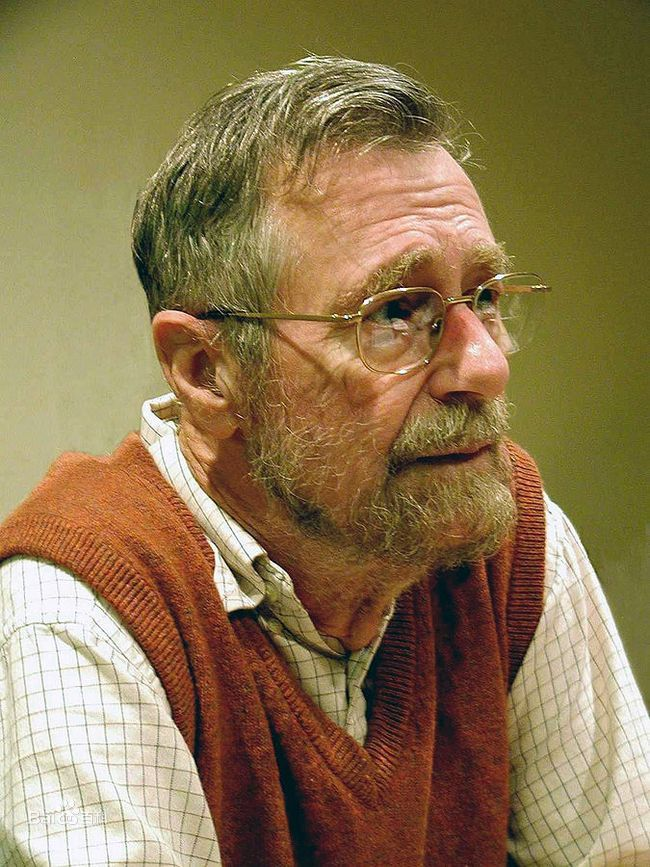

#LeetCodeNote

***

##Be your own master.
####This note records the process and questions i wrote on leetcode. I just want to make a simple record so that i can review and summarize later. After all , some ideas for solving problems are occasionally forgotten.

***

####Dijkstra: Master, superstar, and one of the founders of computer science.

***

#####***The contents of this repository are for my study and use, and have not been used for any commercial purposes*.